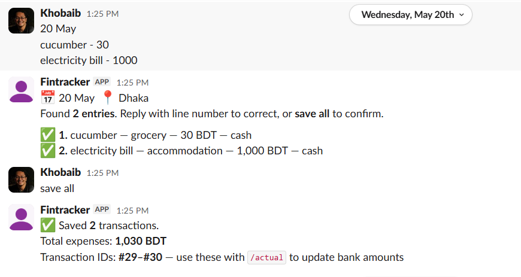

# Fintracker

> A personal finance tracker with a Slack-bot interface and a custom NLP parser.
> Paste daily expenses the way you already write them. Get an instant review. Save with one word.

---

## The problem

I'd been tracking personal finances manually for 3 years — daily notes in a phone app, weekly reconciliation in Google Sheets, monthly category review. The Sheets workflow consumed 2–3 hours every weekend. Existing tools (Mint, YNAB, Money Manager, every Bangladeshi local app) all failed for the same reason: they make you change how you record expenses.

I didn't want a new way to track. I wanted my existing free-form notation — `rickshaw - 60 + 40 + 30`, `Dinner (Abesh Hotel) - 305 (ebl)`, `Spotify - 2.5 usd (ebl)` — to just *work*.

So I built one.

## What it does

Open Slack, paste your day, get a structured review, save with one word.

```
17 April
bike to office - 150 (uber/cash)
rickshaw - 60 + 40 + 30
Dinner (falguni) - 320
ebl to bkash - 2000
Spotify - 2.5 usd (ebl)
```

The bot parses each line, classifies it across 14 spend categories, detects payment method, handles foreign currencies, separates transfers from expenses, and returns a structured review. Type `save all` to commit, or correct specific lines (`3 treat`, `5 ebl_card`, `7 2000`) before saving.



## Why this is interesting (beyond "another expense tracker")

This project is less about expense tracking and more about four product/engineering questions I wanted to work through end-to-end:

1. **What happens when "no UI is the best UI" is taken seriously?** Every other personal-finance tool ships a mobile app or web dashboard — another tool to install, another place to context-switch to. Slack was already open on every device I own, every day. So the "UI" became a Slack channel: zero installation, zero context switch, works on phone and desktop identically, and the bot's responses are themselves the interface. The design constraint forced cleaner thinking everywhere else.
2. **Can a deterministic rules engine on free-form text get you 70%+ accuracy** before you even need an LLM? (Answer: yes — measured at 68% over 5 months of real data, see [accuracy baseline](#accuracy-baseline).)
3. **How do you design a parser that adapts to the human, not the other way around?** Free-form notation, arithmetic in amounts, two foreign-currency formats, mixed payment methods, third-party paid patterns, trip-vs-home segmentation — all handled without forms or dropdowns.
4. **What does it look like to build a product with Claude as a collaborator from PRD to deployment?** Every architectural decision, edge case, and rules-engine rewrite went through structured conversation with Claude, with the PRD as the single source of truth.

## Product documentation

The full PRD (v1.5.2, May 2026) lives in [`/PRDs`](./PRDs). It covers:

- Input format conventions and the **bracket rule** (first bracket = name context, last bracket = payment method — the single rule that lets free-form text parse predictably)
- Amount parsing, including arithmetic expressions, foreign-currency suffixes (`k`, `m`), and two rate formats (`1 USD = 122.5 BDT` vs `1 BDT = 1/140.6 IDR`)
- 14-category classification taxonomy with full keyword reference
- The three-layer classification stack: explicit `#tag` overrides → name-prefix treat rule → keyword rules engine → LLM classifier (Phase 2)
- Transfer detection logic (the tricky one: `wasim loan` = transfer, `ebl loan pay` = expense)
- Accuracy baseline measured on 659 real entries across 5 months
- Phase 1 (rules engine, current) and Phase 2 (LLM classifier) scope split

If you only have 5 minutes, read the PRD's "What's New in v1.5.2" table and Section 5 ("Transaction Classification") — that's where the design thinking is densest.

## Accuracy baseline

Measured March–July 2025 against ground truth from my existing Google Sheets:

| | Count | % | Notes |
|---|---|---|---|
| Total expense/investment rows | 659 | 100% | Transfers excluded from accuracy measurement |
| Correctly classified by rules | 448 | **68%** | Zero user intervention required |
| Historical exceptions | 165 | 25% | Pre-existing data using older category schemes |
| Genuine ambiguity | 46 | **5%** | Routed to LLM classifier in Phase 2 |

Historical exceptions are expected and explained: `treat` keyword was added later than the underlying data, `grocery` as a category was added November 2025, etc. The metric to optimise is the 68%-correct-by-rules + 5%-genuinely-ambiguous split — the rest is closing the gap on edge cases.

## Architecture

Two files, two jobs:

- **`parser.py`** — understands text. Parsing, classification, rules engine, review summary formatting. No I/O.
- **`bot.py`** — talks to Slack and the database. Commands, session state, database writes, corrections.

```
┌────────────┐    ┌──────────┐    ┌────────────┐    ┌──────────────┐
│   Slack    │ ─→ │  bot.py  │ ─→ │ parser.py  │ ─→ │  Review      │
│  message   │    │ (Bolt    │    │  (rules    │    │  back to     │
│  paste     │    │  socket  │    │  engine,   │    │  Slack       │
└────────────┘    │  mode)   │    │  taxonomy) │    └──────────────┘
                  └────┬─────┘    └────────────┘
                       │
                       ▼
                  ┌──────────┐    ┌──────────────┐
                  │ SQLite   │ ↔  │ Google       │
                  │ (Railway │    │ Sheets       │
                  │ volume)  │    │ (data        │
                  └──────────┘    │ ownership)   │
                                  └──────────────┘
```

**Tech stack:** Python 3.11+ • SQLite • Slack Bolt SDK (socket mode) • Anthropic Claude API (Phase 2) • Google Sheets API (data sync) • Railway (hosting + persistent volume) • pytest (209 tests).

## Built with Claude

This project was developed in close collaboration with Claude — from PRD drafting through architecture decisions through rules-engine iteration. The pattern that worked:

1. **Decisions in conversation, recorded in the PRD.** Anthropic's Claude was my collaborator for working through edge cases (how should `Dinner (Abesh Hotel)` classify when "Hotel" is a strong accommodation signal but "Dinner" is a stronger food signal? → the first-bracket-is-name rule).
2. **Real data as the source of truth.** Every rules-engine change was tested against the 659-entry dataset before committing. If a change improved one case but regressed two others, it was rejected.
3. **PRD as the single source of truth.** When Claude and I disagreed on something, the PRD's existing rule won unless we explicitly changed the PRD. This prevents drift between "what the code does" and "what the product is supposed to do."

The development pattern itself is the more transferable artifact than the product. It's how I'd run a real PM-with-engineering-pair workflow.

## Quick start

See [`SETUP.md`](./SETUP.md) for full setup (Slack app creation, environment variables, local run, Railway deployment). The 30-second version:

```bash
git clone https://github.com/khobaib/fintracker
cd fintracker
python -m venv venv
venv/Scripts/activate   # or source venv/bin/activate on macOS/Linux
pip install -r requirements.txt
cp .env.example .env    # fill in your Slack tokens
python init_db.py
python test_parser.py   # 145 tests should pass
python test_bot.py      # 64 tests should pass
python bot.py
```

For Railway deployment, see [`Docs/railway_setup.md`](./Docs/railway_setup.md).

## Testing

```bash
python test_parser.py   # 145 parser tests — classification, amount parsing, edge cases
python test_bot.py      # 64 bot integration tests — sessions, saves, corrections
```

The parser tests are the most informative read for anyone evaluating the rules engine — each test is a real (or realistic) paste with the expected classification output.

## Roadmap

**Phase 1 (current — complete):** Rules engine, Slack interface, Railway deployment, Google Sheets sync.

**Phase 2 (next):** LLM classifier for the 5% genuinely ambiguous cases. Training data is being collected from user corrections during reviews.

**Beyond Phase 2:** Google Sheets historical importer (3 years of legacy data), web dashboard, bKash reconciliation, money-to-collect tracker for shared expenses.

## File structure

```
fintracker/
├── bot.py                 # Slack bot — commands, sessions, database writes
├── parser.py              # Entry parser — text to data, rules engine, display
├── schema_v3_final.sql    # Database schema, classifier rules, taxonomy
├── init_db.py             # Database initializer
├── requirements.txt       # Python dependencies
├── test_parser.py         # 145 parser tests
├── test_bot.py            # 64 bot integration tests
├── PRDs/                  # Versioned product documentation
├── Docs/                  # Setup guides, Railway deployment guide
├── CHANGELOG.md           # Version history
└── README.md              # This file
```

## About the author

Built by [Khobaib Chowdhury](https://www.linkedin.com/in/khobaib-chowdhury-554a104/) — Senior Product Manager with engineering background, specialising in marketplace and operations-heavy products. This project is part of a broader effort to demonstrate AI-tool collaboration patterns I'd use in a senior PM role.

Open to senior PM opportunities — [khobaib@gmail.com](mailto:khobaib@gmail.com).

## License

MIT — see [LICENSE](./LICENSE).
